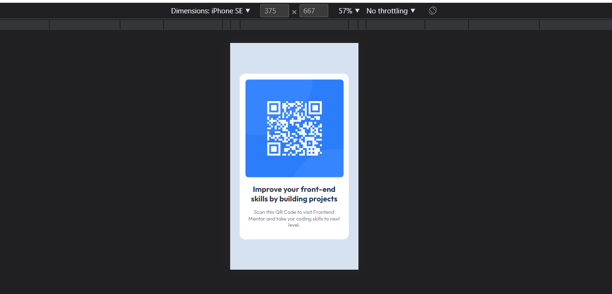

# Frontend Mentor - QR code component solution

This is a solution to the [QR code component challenge on Frontend Mentor](https://www.frontendmentor.io/challenges/qr-code-component-iux_sIO_H). Frontend Mentor challenges help you improve your coding skills by building realistic projects. 

## Overview

### Screenshot

### Links

- Solution URL: [Add solution URL here](https://github.com/sudhanshu287/FrontendMentorChallenges/tree/main/qr-code-component-main)
- Live Site URL: [Add live site URL here](https://qr-code-component-beta-five.vercel.app/)

## My process

### Built with

- Semantic HTML5 markup
- CSS custom properties
- Flexbox

## Author

- Website - [Sudhanshu Patel](https://sudhanshupatel.vercel.app/)
- Frontend Mentor - [@Sudhanshu Patel](https://www.frontendmentor.io/profile/sudhanshu287)
- LinkedIN - [@Sudhanshu Patel](https://linkedin.com/in/sudhanshu287/)

## **Let's Connect 👋**

  &nbsp;&nbsp;&nbsp;

   &nbsp;&nbsp;&nbsp;

  

